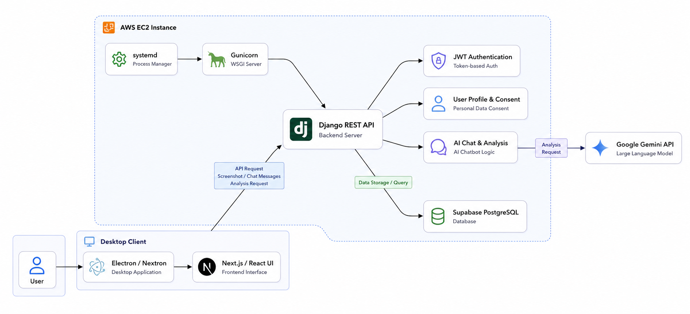
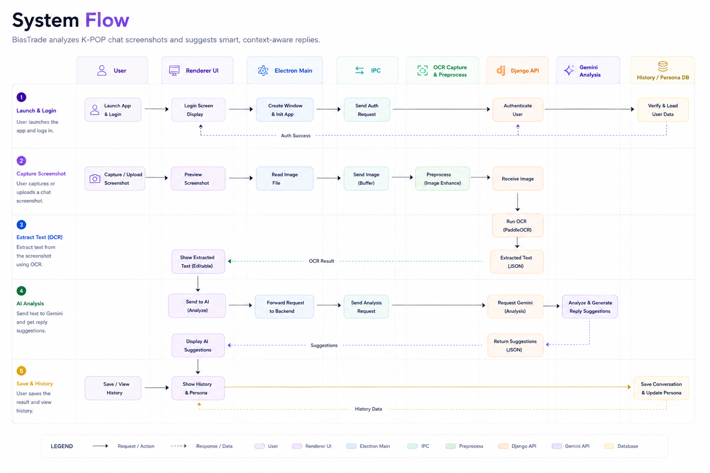
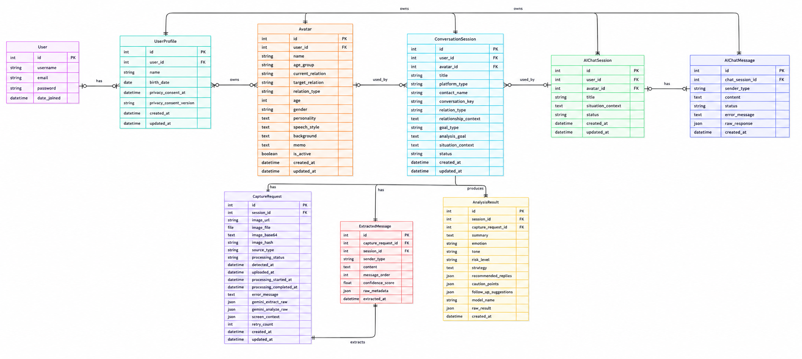
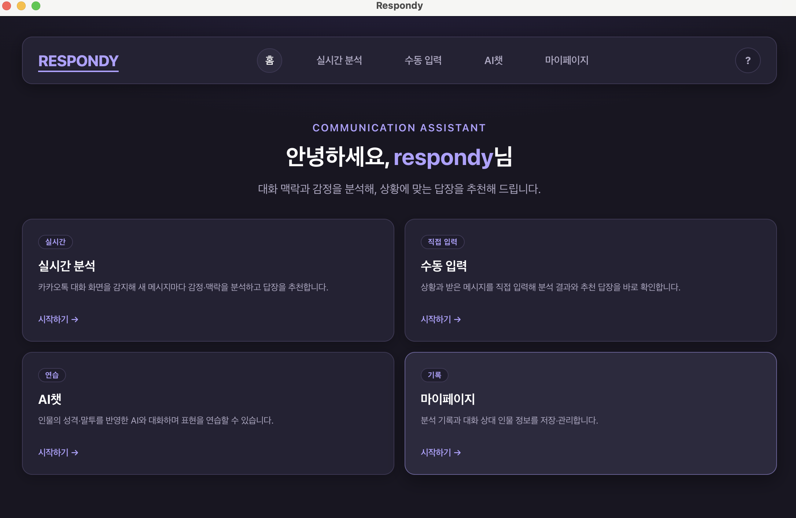
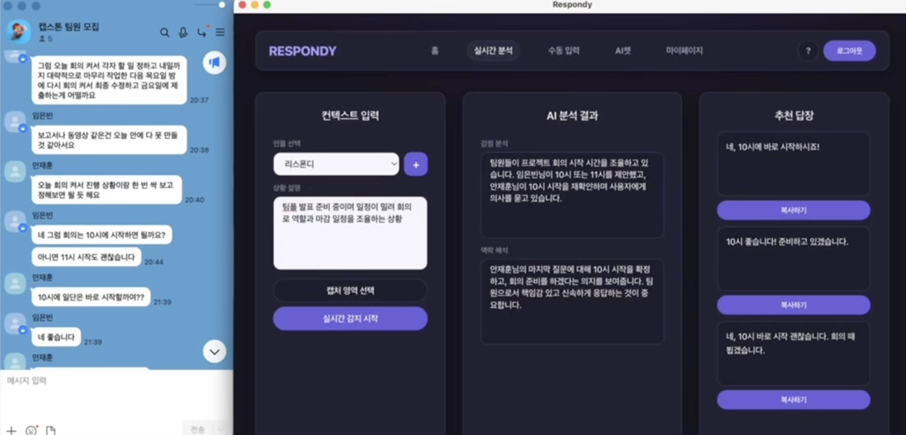
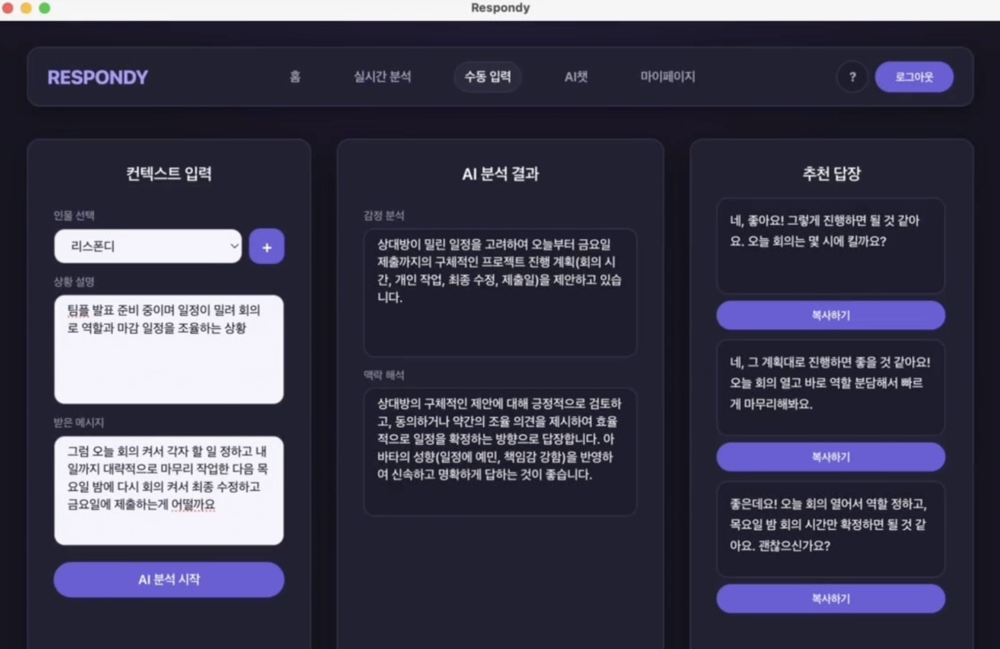
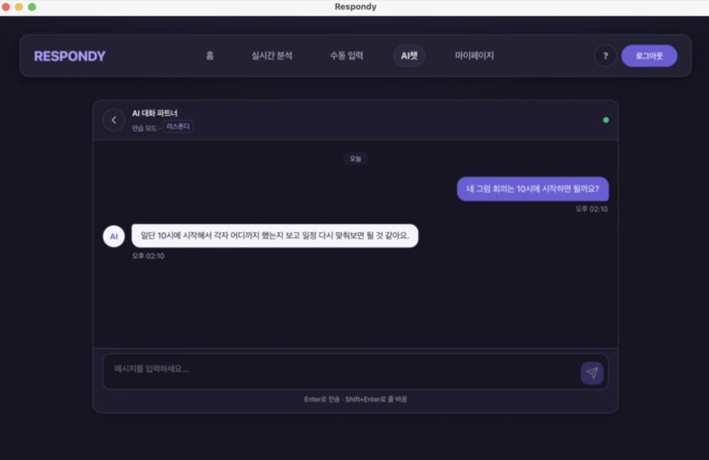
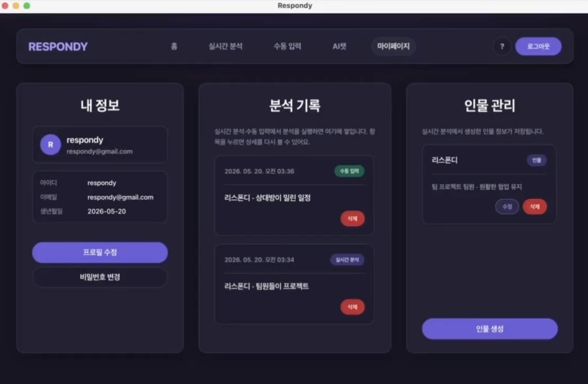

# RESPONDY

An AI-powered desktop chat assistant that provides real-time, context-aware reply suggestions from chat screenshots.


---

## Overview

Respondy is an AI-powered desktop chat assistant that helps users write better replies from chat screenshots.  
Users can upload screenshots, receive AI-generated response suggestions, and review conversation history in a single desktop application.

The application streamlines everyday messaging by combining real-time screenshot analysis with Gemini-powered response generation in an Electron desktop environment.

---

## Workflow

1. Users upload a chat screenshot through the desktop application.
2. The frontend sends the image to backend services via REST APIs.
3. The backend analyzes the screenshot and generates reply suggestions using Gemini.
4. Suggested replies and conversation history are displayed in the desktop application.

---

## Features

- Real-time screenshot analysis
- Real-time AI reply suggestions
- Conversation history
- Desktop application built with Electron
- REST API integration

---

## Tech Stack

- **Frontend**
  - Electron
  - Nextron (Next.js + Electron)
  - React
  - Tailwind CSS

- **Backend**
  - Django REST API
  - Google Gemini API integration

- **Database**
  - Backend-managed relational DB (configured in Django)
  - Electron local storage (`electron-store`) for client runtime settings

- **Cloud**
  - API server hosting environment (project-specific)
  - (Optional) Supabase integration modules in repository

---

## Architecture



---

## System Flow



---

## ERD



---

## Screenshots

### Home


### Real-time Analysis


### Manual Input


### AI Chat


### My Page


---

## Folder Structure

```txt
main/                     # Electron main process
  background.ts
  services/
  region-picker.html

renderer/                 # Nextron/Next.js renderer (UI)
  app/
  styles/
  lib/

shared/                   # Shared types between main and renderer

scripts/                  # Build/helper scripts
resources/                # App icons and build assets
```

---

## Installation

### Requirements

- Node.js 20+
- macOS or Windows
- Running Django API server (`API_BASE_URL`)

### Local Development

```bash
cp .env.example .env
# set API_BASE_URL in .env or .env.local
npm install
npm run dev
```

### Build

```bash
# macOS package
npm run build

# Windows .exe (from macOS or Windows)
npx electron-builder --win --x64
```

Build outputs are generated in `dist/`.

---

## Challenges

- Delivering AI-generated reply suggestions with minimal delay after screenshot upload
- Integrating Electron and REST APIs while keeping a smooth desktop user experience
- Managing asynchronous image upload, analysis, and response updates efficiently

---

## What We Learned

- How to build and operate an Electron desktop application with Next.js and React
- Practical experience integrating real-time REST API workflows into desktop UI
- Stronger understanding of asynchronous state management and API-driven rendering
- Better understanding of how frontend clients coordinate with AI-powered backend services

---

## Improvements

- Better multi-platform messenger support (beyond current primary flow)
- Stronger persona memory for long-term conversation continuity
- Improved retry/fallback strategy for backend failures
- Security hardening and production auth flow cleanup
- Optional analytics dashboard for communication pattern insights
